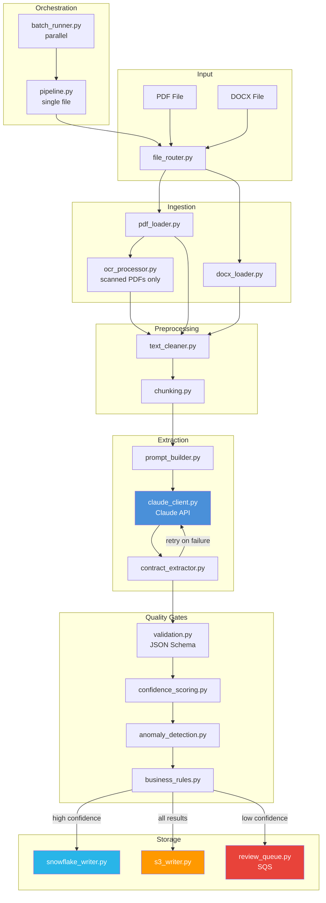
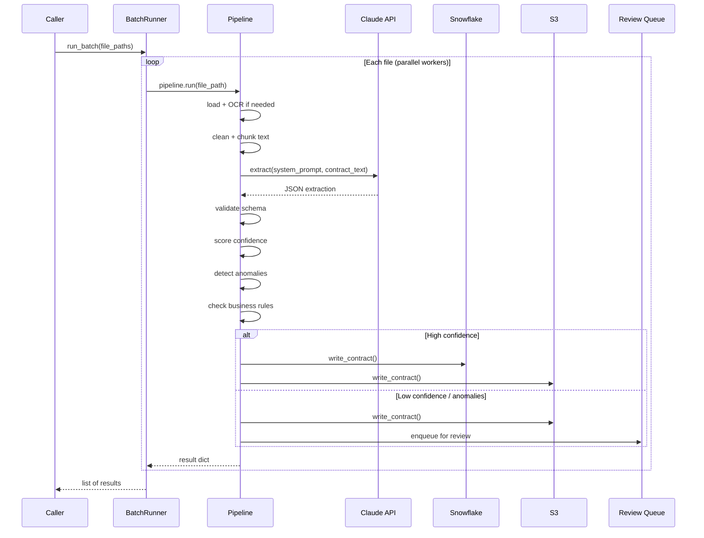
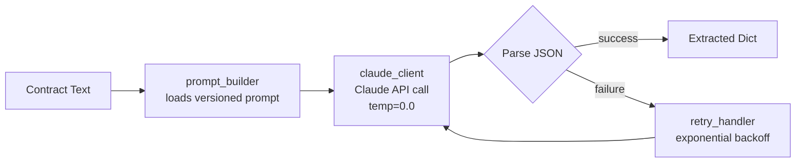
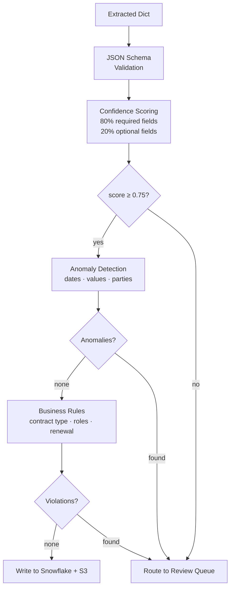

# Contract Extraction Pipeline

An end-to-end AI pipeline that ingests PDF and DOCX contracts, extracts structured fields using Claude, validates quality, and writes results to Snowflake and S3 — with low-confidence documents automatically routed to a human review queue.

---

## Table of Contents

- [Architecture](#architecture)
- [Data Flow](#data-flow)
- [Project Structure](#project-structure)
- [Components](#components)
- [Quick Start](#quick-start)
- [Configuration](#configuration)
- [Extracted Fields](#extracted-fields)
- [Quality Pipeline](#quality-pipeline)
- [Evaluation](#evaluation)
- [Testing](#testing)

---

## Architecture



---

## Data Flow



---

## Project Structure

```
contract-extraction/
│
├── app/
│   ├── ingestion/          # File loading
│   │   ├── pdf_loader.py       → pdfplumber-based PDF text extraction
│   │   ├── docx_loader.py      → python-docx paragraph extraction
│   │   └── file_router.py      → routes files by extension
│   │
│   ├── preprocessing/      # Text preparation
│   │   ├── ocr_processor.py    → Tesseract OCR for scanned pages
│   │   ├── text_cleaner.py     → strip non-ASCII, collapse whitespace
│   │   └── chunking.py         → page-aware chunking with overlap
│   │
│   ├── extraction/         # Claude integration
│   │   ├── claude_client.py    → Anthropic SDK wrapper
│   │   ├── prompt_builder.py   → loads versioned prompts
│   │   ├── contract_extractor.py → orchestrates extraction + JSON parse
│   │   └── retry_handler.py    → exponential backoff retry
│   │
│   ├── schemas/            # Data contracts
│   │   ├── contract_schema.json → JSON Schema for extracted fields
│   │   └── validation.py        → jsonschema validator
│   │
│   ├── quality/            # Quality assurance
│   │   ├── confidence_scoring.py → weighted field coverage score
│   │   ├── anomaly_detection.py  → date/value sanity checks
│   │   └── business_rules.py     → domain-specific rule enforcement
│   │
│   ├── storage/            # Output writers
│   │   ├── snowflake_writer.py → structured fields → Snowflake
│   │   ├── s3_writer.py        → JSON + raw text → S3
│   │   └── review_queue.py     → low-confidence → SQS
│   │
│   └── orchestration/      # Pipeline wiring
│       ├── pipeline.py         → single-file end-to-end pipeline
│       └── batch_runner.py     → parallel batch via ThreadPoolExecutor
│
├── prompts/                # Versioned extraction prompts
│   ├── contract_extraction_v1.md   → baseline prompt
│   ├── contract_extraction_v2.md   → current (richer instructions)
│   └── amendment_prompt.md         → amendment delta extraction
│
├── evaluation/             # Accuracy benchmarking
│   ├── datasets/           → ground-truth contract sets
│   ├── benchmark.py        → runs pipeline over dataset
│   ├── scoring.py          → field-level accuracy scoring
│   └── evaluation_report.py → generates JSON accuracy report
│
├── tests/
│   ├── unit/               → confidence, anomaly, text cleaning
│   └── integration/        → full pipeline end-to-end
│
├── config/
│   ├── dev.yaml            → development environment
│   ├── qa.yaml             → QA environment
│   └── prod.yaml           → production environment
│
├── docs/
│   ├── architecture.md     → system design details
│   ├── prompt_strategy.md  → prompt versioning and iteration
│   └── runbook.md          → operational guide
│
└── requirements.txt
```

---

## Components

### Ingestion

| Module | Input | Output |
|--------|-------|--------|
| `pdf_loader.py` | `.pdf` file path | `{source, page_count, pages[{page, text}]}` |
| `docx_loader.py` | `.docx` file path | `{source, paragraph_count, text}` |
| `file_router.py` | any supported file | dispatches to correct loader |
| `ocr_processor.py` | scanned page | raw OCR text via Tesseract |

### Preprocessing

| Module | What it does |
|--------|-------------|
| `text_cleaner.py` | Strips non-printable characters, collapses whitespace, removes hyphenation artifacts |
| `chunking.py` | Splits pages into chunks ≤ `max_chars` to fit within Claude's context window |

### Extraction



### Quality Gates



**Confidence scoring formula:**

```
overall = 0.8 × mean(required_field_scores) + 0.2 × mean(optional_field_scores)
```

Required fields: `parties`, `effective_date`, `expiration_date`, `total_value`, `governing_law`, `payment_terms`

---

## Quick Start

### 1. Install dependencies

```bash
pip install -r requirements.txt
```

### 2. Set environment variables

```bash
export ANTHROPIC_API_KEY=sk-ant-...
export SNOWFLAKE_ACCOUNT=your-account
export SNOWFLAKE_USER=your-user
export SNOWFLAKE_PASSWORD=your-password
export SQS_QUEUE_URL_DEV=https://sqs...
```

### 3. Run a single contract

```python
from app.orchestration.pipeline import ExtractionPipeline

result = ExtractionPipeline().run("path/to/contract.pdf")
print(result["extracted"])
print(result["scores"])
print(result["needs_review"])
```

### 4. Run a batch

```python
from app.orchestration.batch_runner import run_batch, discover_files

files = discover_files("data/contracts/")
results = run_batch(files, max_workers=4)
```

---

## Configuration

Each environment (`dev`, `qa`, `prod`) has its own YAML config:

| Setting | Dev | QA | Prod |
|---------|-----|----|------|
| `pipeline.max_workers` | 2 | 4 | 8 |
| `pipeline.confidence_threshold` | 0.75 | 0.80 | 0.85 |
| `claude.max_retries` | 3 | 3 | 5 |
| `logging.level` | DEBUG | INFO | WARNING |
| Snowflake DB | `CONTRACTS_DEV` | `CONTRACTS_QA` | `CONTRACTS_PROD` |

---

## Extracted Fields

| Field | Type | Description |
|-------|------|-------------|
| `contract_id` | string | Contract identifier |
| `contract_type` | enum | MSA · SOW · NDA · Amendment · PO · Other |
| `parties` | array | Name, role, and address of each party |
| `effective_date` | date | Contract start date (YYYY-MM-DD) |
| `expiration_date` | date | Contract end date (YYYY-MM-DD) |
| `auto_renewal` | boolean | Whether contract auto-renews |
| `renewal_notice_days` | integer | Days notice required to prevent renewal |
| `total_value` | number | Total contract value |
| `currency` | string | Currency code (USD, EUR, …) |
| `payment_terms` | string | Payment terms (e.g. Net 30) |
| `governing_law` | string | Jurisdiction |
| `termination_for_convenience` | boolean | Whether either party can terminate without cause |
| `liability_cap` | number | Maximum liability amount |
| `key_obligations` | array | Top material obligations |
| `sla_terms` | array | Measurable service level commitments |
| `amendments` | array | References to amendments |

---

## Evaluation

Benchmark the pipeline against a labeled dataset:

```bash
# Place contracts in evaluation/datasets/standard_contracts/
# Place matching ground-truth JSON in evaluation/datasets/ground_truth/

python -m evaluation.benchmark
python -m evaluation.evaluation_report
```

Output `evaluation_report.json`:

```json
{
  "overall_accuracy": 0.87,
  "field_averages": {
    "effective_date": 0.94,
    "expiration_date": 0.91,
    "total_value": 0.83,
    "governing_law": 0.96
  },
  "per_file": [...]
}
```

**Accuracy scoring rules:**

| Field type | Match criteria |
|------------|---------------|
| Dates | Exact YYYY-MM-DD match |
| Numbers | Within 1% relative tolerance |
| Strings | Case-insensitive exact match |
| Null fields | Predicted null = correct |

---

## Testing

```bash
# Unit tests (no API key required)
pytest tests/unit/ -v

# Integration test (requires ANTHROPIC_API_KEY)
pytest tests/integration/ -v -s
```

| Test | What it covers |
|------|---------------|
| `test_confidence_scoring.py` | Weighted scoring formula, high/low confidence thresholds |
| `test_anomaly_detection.py` | Date ordering, negative values, missing parties |
| `test_text_cleaner.py` | Non-ASCII removal, whitespace normalization |
| `test_pipeline_integration.py` | Full pipeline end-to-end on a generated DOCX |

---

## Prompt Versioning

Prompts are plain Markdown files in `prompts/`. Switch versions by passing `prompt_version`:

```python
extractor.extract(text, prompt_version="contract_extraction_v1.md")
extractor.extract(text, prompt_version="contract_extraction_v2.md")  # default
```

See [`docs/prompt_strategy.md`](docs/prompt_strategy.md) for the iteration process.
