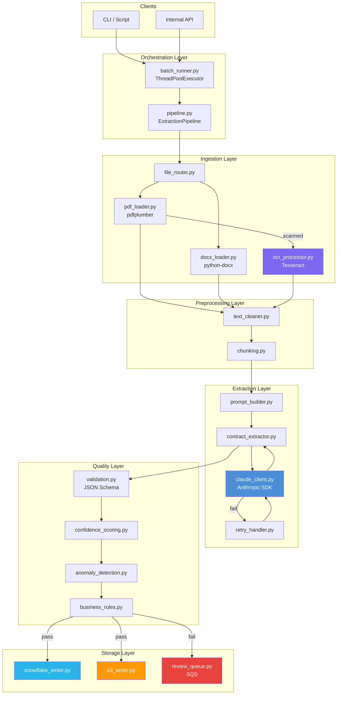
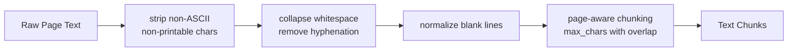
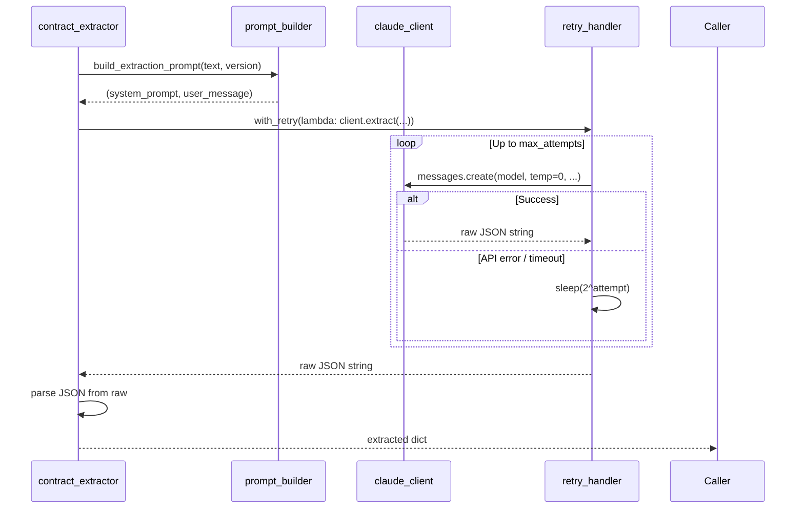
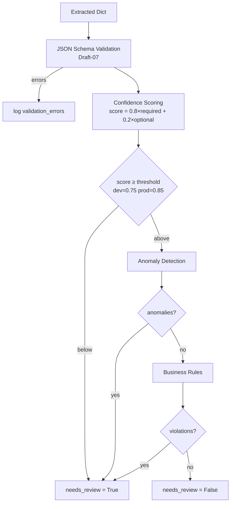
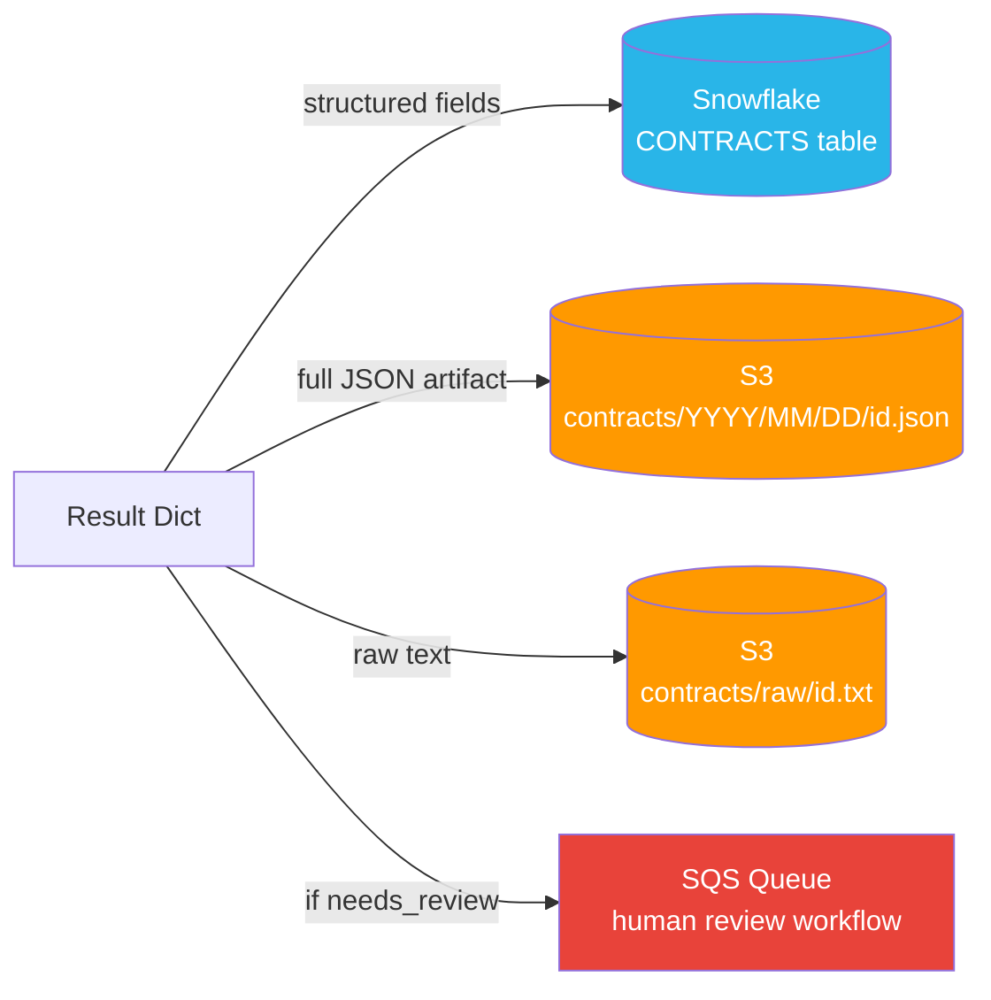
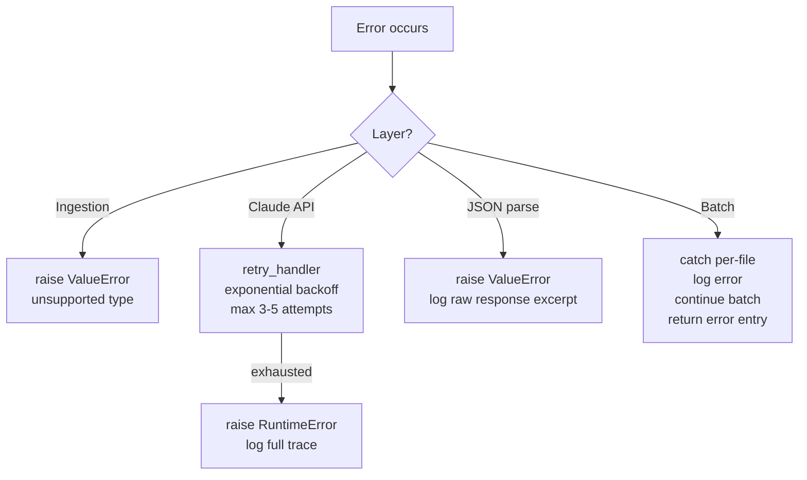

# Architecture

## System Overview

---

## Module Responsibilities

### Orchestration

| Module | Responsibility |
|--------|---------------|
| `pipeline.py` | Wires all stages for a single file; returns a result dict with extracted data, scores, anomalies, and review flag |
| `batch_runner.py` | Parallelizes pipeline across a list of files using `ThreadPoolExecutor`; aggregates results and errors |

### Ingestion

| Module | Library | Notes |
|--------|---------|-------|
| `pdf_loader.py` | pdfplumber | Extracts text per page; preserves page metadata for chunking |
| `docx_loader.py` | python-docx | Joins non-empty paragraphs; treats whole document as single page |
| `ocr_processor.py` | pytesseract | Applied only when a PDF page returns empty text |
| `file_router.py` | — | Dispatches on file extension; raises `ValueError` for unsupported types |

### Preprocessing

**Chunking strategy:** Pages are grouped until the combined character count exceeds `max_chars` (default 8,000). Each chunk tracks which page numbers it spans — useful for citation back to the source document.

### Extraction

**Design decisions:**
- `temperature=0.0` — deterministic output for consistent field extraction
- JSON parsed by finding the first `{` and last `}` — tolerant of preamble text
- Amendment extraction uses a separate prompt that diffs original vs. amendment text

### Quality Gates

**Confidence weight rationale:** Required fields (parties, dates, value, terms, jurisdiction) are the fields downstream systems rely on. Optional fields improve completeness but a missing SLA list shouldn't block automated processing.

**Anomaly checks:**
- `expiration_date` must be after `effective_date`
- `total_value` must be non-negative
- `liability_cap` must be < 10× `total_value`
- At least one party must be identified

**Business rule checks:**
- `contract_type` must be a known enum value
- At least one buyer or licensee party required
- If `auto_renewal = true`, `renewal_notice_days` must be present

### Storage

---

## Deployment Environments

| Concern | Dev | QA | Prod |
|---------|-----|----|------|
| Workers | 2 | 4 | 8 |
| Confidence threshold | 0.75 | 0.80 | 0.85 |
| Claude retries | 3 | 3 | 5 |
| Snowflake DB | CONTRACTS_DEV | CONTRACTS_QA | CONTRACTS_PROD |
| Log level | DEBUG | INFO | WARNING |

---

## Error Handling Strategy

No single file failure aborts the batch — errors are captured per-file and the batch continues.
