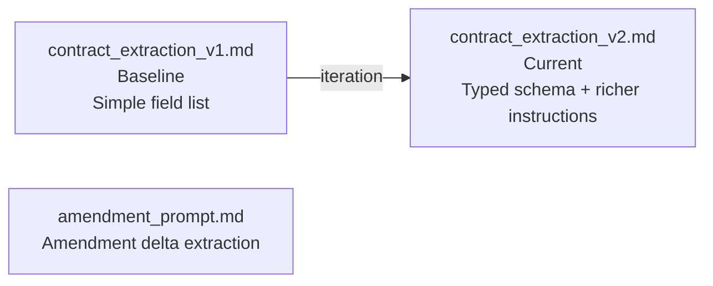
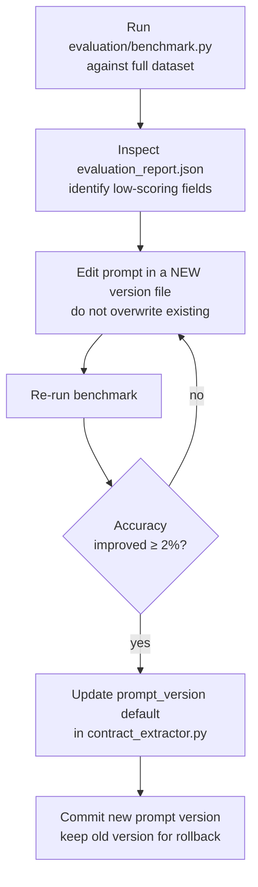
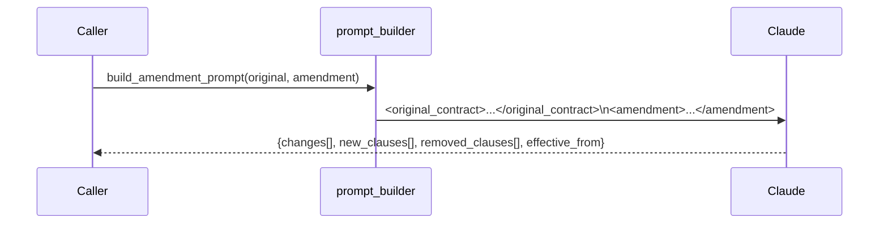

# Prompt Strategy

## Prompt Versioning

Prompts live in `prompts/` as plain Markdown files. The active version is passed explicitly to `ContractExtractor.extract()`.



| File | Status | Key change |
|------|--------|-----------|
| `contract_extraction_v1.md` | Deprecated | Minimal field list, no output schema |
| `contract_extraction_v2.md` | **Active** | Typed JSON schema, null-over-empty rule, XML input wrapping |
| `amendment_prompt.md` | Active | Compares original vs. amendment, returns `changes[]` array |

---

## Prompt Design Principles

### 1. Zero Temperature

All extraction calls use `temperature=0.0`. Contract extraction is not a creative task — deterministic output is required for consistent field parsing and reliable regression testing.

### 2. JSON-Only Output

Prompts explicitly instruct Claude to return raw JSON with no surrounding text, markdown fences, or commentary. The extractor finds the first `{` and last `}` to handle any accidental preamble.

```
Return ONLY the JSON object. Do not add commentary, markdown fences,
or any text outside the JSON.
```

### 3. Null Over Empty String

Missing fields must be `null`, not `""`. This is enforced in the prompt and validated by the JSON Schema. Empty strings break confidence scoring (a field appears "present" but carries no information).

### 4. XML Input Wrapping

Contract text is wrapped in `<contract>` tags to clearly separate input from instructions and prevent injection of instruction-like text in contracts from influencing extraction behavior.

```
<contract>
[contract text here]
</contract>
```

### 5. Typed Output Schema

`v2` embeds a typed JSON schema directly in the prompt so Claude can self-validate its output before returning:

```json
{
  "effective_date": "YYYY-MM-DD or null",
  "total_value": number_or_null,
  "auto_renewal": true|false,
  ...
}
```

---

## Iteration Process



**Never delete old prompt versions.** They are the rollback path if a new version regresses on a previously-working contract type.

---

## Amendment Extraction

Amendment prompts use a two-document approach:



Each `change` entry includes `field`, `old_value`, `new_value`, and a plain-English `description`. This allows downstream systems to apply deltas rather than re-processing the full contract.

---

## Known Failure Modes

| Failure | Root cause | Mitigation |
|---------|-----------|-----------|
| JSON parse error | Claude returned preamble before `{` | Extractor strips to first `{` / last `}` |
| Truncated JSON | Contract too long for single chunk | Reduce `chunk_size`; implement multi-chunk merge |
| Wrong date format | Contract uses non-standard date format | Prompt instructs YYYY-MM-DD; anomaly detection catches inversions |
| Hallucinated values | Low-quality OCR input | OCR quality check before extraction; flag in anomaly detection |
| Missing parties | Complex multi-party agreements | Prompt asks to identify ALL named parties |
