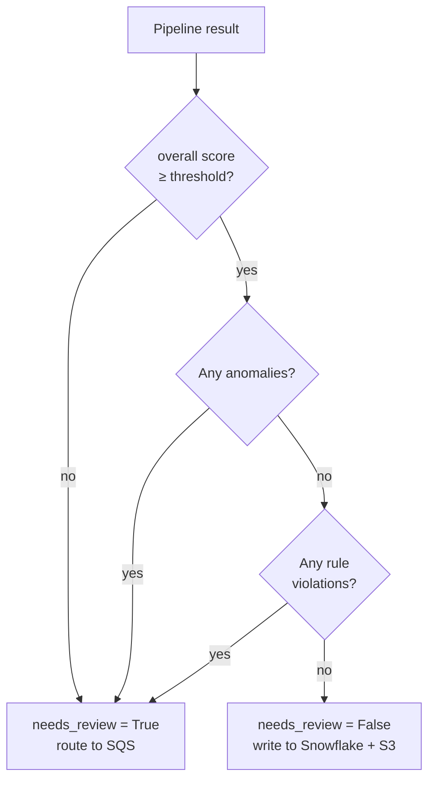

# Runbook

## Environment Setup

### Required Environment Variables

| Variable | Description | Example |
|----------|-------------|---------|
| `ANTHROPIC_API_KEY` | Claude API key | `sk-ant-...` |
| `SNOWFLAKE_ACCOUNT` | Snowflake account ID | `xy12345.us-east-1` |
| `SNOWFLAKE_USER` | Snowflake username | `svc_contract_extraction` |
| `SNOWFLAKE_PASSWORD` | Snowflake password | — |
| `SQS_QUEUE_URL_DEV` | SQS review queue (dev) | `https://sqs.us-east-1...` |
| `SQS_QUEUE_URL_QA` | SQS review queue (QA) | — |
| `SQS_QUEUE_URL_PROD` | SQS review queue (prod) | — |

### Install Dependencies

```bash
pip install -r requirements.txt
```

For OCR support, Tesseract must also be installed at the OS level:

```bash
# macOS
brew install tesseract

# Ubuntu/Debian
apt-get install tesseract-ocr

# Windows
# Download installer from: https://github.com/UB-Mannheim/tesseract/wiki
```

---

## Running the Pipeline

### Single File

```python
from app.orchestration.pipeline import ExtractionPipeline

pipeline = ExtractionPipeline(model="claude-sonnet-4-6")
result = pipeline.run("contracts/acme_msa_2024.pdf")

print(f"Needs review: {result['needs_review']}")
print(f"Confidence:   {result['scores']['overall']}")
print(f"Anomalies:    {result['anomalies']}")
print(f"Extracted:    {result['extracted']}")
```

### Batch

```python
from app.orchestration.batch_runner import run_batch, discover_files

files = discover_files("contracts/", extensions=(".pdf", ".docx"))
results = run_batch(files, model="claude-sonnet-4-6", max_workers=4)

succeeded = [r for r in results if "error" not in r]
failed    = [r for r in results if "error" in r]
print(f"Processed: {len(succeeded)} succeeded, {len(failed)} failed")
```

---

## Result Structure

```
{
  "file": "path/to/contract.pdf",
  "extracted": {
    "contract_id": "...",
    "contract_type": "MSA",
    "parties": [...],
    "effective_date": "2024-01-01",
    "expiration_date": "2025-01-01",
    ...
  },
  "scores": {
    "field_scores": { "effective_date": 1.0, "total_value": 0.0, ... },
    "overall": 0.83
  },
  "validation_errors": [],
  "anomalies": [],
  "rule_violations": [],
  "needs_review": false
}
```

---

## Decision Flow: needs_review



---

## Evaluation

```bash
# 1. Place labeled contracts in:
#    evaluation/datasets/standard_contracts/   ← .pdf or .docx files
#    evaluation/datasets/ground_truth/         ← matching .json files (same stem)

# 2. Run benchmark
python -m evaluation.benchmark

# 3. Generate report
python -m evaluation.evaluation_report
# → writes evaluation_report.json
```

**When to run evaluation:**
- Before promoting a new prompt version
- After any change to `confidence_scoring.py`, `anomaly_detection.py`, or `business_rules.py`
- When adding a new contract type to the dataset

---

## Troubleshooting

### JSON parse failure

**Symptom:** `ValueError: Failed to parse Claude response as JSON`

**Cause:** Claude returned text before or after the JSON, or context was truncated mid-JSON.

**Fix:**
1. Check logs for the raw response.
2. If truncated: reduce `chunk_size` in config (default 4000 chars).
3. If preamble: verify the prompt ends with `Return ONLY the JSON object.`

---

### Low confidence scores

**Symptom:** `scores.overall` consistently below threshold for a contract type.

**Cause:** Prompt doesn't handle the contract's structure; or OCR quality is poor.

**Fix:**
1. Run `evaluation/benchmark.py` to identify which fields score 0.0.
2. Add contract examples to `evaluation/datasets/` with ground truth.
3. Iterate the prompt per [`docs/prompt_strategy.md`](prompt_strategy.md).

---

### OCR quality issues

**Symptom:** Extracted text is garbled for scanned PDFs.

**Fix:**
1. Pre-process the scan at higher DPI (300+ recommended).
2. For non-English contracts, install the Tesseract language pack and pass `lang` to `run_ocr()`.
3. Flag poor-OCR contracts with `anomaly_detection` and route to manual review.

---

### Batch job stalling

**Symptom:** `run_batch()` hangs indefinitely.

**Cause:** A thread is blocked on a Claude API call that never times out.

**Fix:**
1. The Anthropic SDK respects `timeout` — add `timeout=60` to `client.messages.create()` in `claude_client.py`.
2. Reduce `max_workers` to avoid exhausting connection pool.

---

## Rollback

To roll back to a previous prompt version without a code deploy:

```python
result = pipeline.extractor.extract(
    contract_text,
    prompt_version="contract_extraction_v1.md"  # previous version
)
```

To roll back the scoring threshold, update the relevant `config/*.yaml` and restart.
